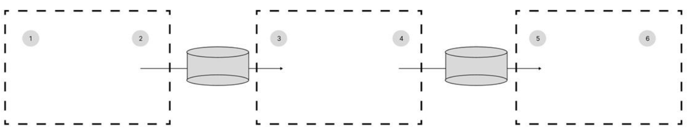

아래 그림에서의 네트워크에서 라우터을 통한 할당 가능한  2번, 4번, 5번의 IP를 작성하시오.

1) 192.168.35.3/24
3) 129.200.10.16/22
6) 192.168.36.24/24

<보기>

1. 192.168.35.0
2. 192.168.35.72
3. 192.168.36.0
4. 192.168.36.249
5. 129.200.8.0
6. 129.200.8.249

# 2번 구하기
IP 주소 & 24
192.168.35.3 AND 255.255.255.0
192.168.35.0 ~ 192.168.35.255
네트워크주소 0, 브로드캐스트 주소 255 제외
192.168.35.1 ~ 192.168.35.254
2번

나머지 반복